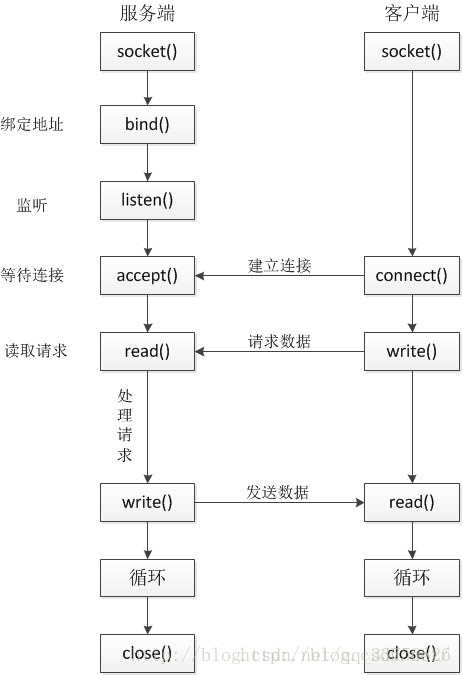

UNIX Domain Socket是目前最广泛使用的IPC机制。

socket起源于Unix，而Unix/Linux基本哲学之一就是“一切皆文件”，都可以用“打开open –> 读写write/read –> 关闭close”模式来操作。Socket就是该模式的一个实现， socket即是一种特殊的文件，一些socket函数就是对其进行的操作（读/写IO、打开、关闭）。

说白了Socket是应用层与TCP/IP协议族通信的中间软件抽象层，它是一组接口，把复杂的TCP/IP协议族隐藏在Socket接口后面，对用户来说，一组简单的接口就是全部，让Socket去组织数据，以符合指定的协议。

使用套接字除了可以实现网络间不同主机间的通信外，还可以实现同一主机的不同进程间的通信，且建立的通信是双向的通信。socket进程通信与网络通信使用的是统一套接口，只是地址结构与某些参数不同。这就是本示例演示的“本地socket”。



## Sokcet API
头文件: sys/socket.h
```c
struct sockaddr
{
    unsigned short  sa_family ; /* address family*/
    char sa_data[14] ; /*up to 14 bytes of direct address */
} ;
```
说明:
Sa_family : 是地址家族，也成作，协议族，一般都是”AF_XXX”的形式，常用的有:
> AF_INET  Arpa（TCP/IP） 网络通信协议（IPV4）  
> AF_INET6  IPV6  
> AF_UNIX  UNIX 域协议（文件系统套接字）（或称AF_LOCAL   ，Unix域socket）  
> AF_ISO    ISO标准协议  
> AF_NS    施乐网络体统协议  
> AF_IPX  Novell IPX 协议  
> AF_APPLETALK   Appletalk DDS  
> AF_ROUTE 路由套接字  
> AF_KEY 密钥套接字  
 
本示例演示本地socket，显然应该使用AF_LOCAL。

struct socketaddr_in :  
struct sockaddr是通用的套接字地址，而struct sockaddr_in则是internet环境下套接字的地址形式，一般情况下，需要把sockaddr_in结构强制转换成sockaddr结构再传入系统调用函数中。  

struct socketaddr_un :   
针对UNIX域套接字地址。头文件: sys/un.h :
```c
 #define UNIX_PATH_MAX    108
struct sockaddr_un { 
    sa_family_t sun_family;               /* AF_UNIX */ 
    char        sun_path[UNIX_PATH_MAX];  /* pathname */ 
};
```

### socket()函数
> 头文件 ： sys/socket.h  
> int socket(int domain, int type, int protocol);

类比普通文件的打开操作，普通文件的打开操作返回一个文件描述字，而socket()用于创建一个socket描述符（socket descriptor）。  
三个参数：  
1. domain：即协议域，又称为协议族（family）。常用的有 AF_INET、AF_INET6、AF_LOCAL（或称AF_UNIX）、AF_ROUTE。决定了socket的地址类型，如AF_INET决定了要用ipv4地址（32位的）与端口号（16位的）的组合、AF_UNIX决定了要用一个绝对路径名作为地址。
2. type：指定socket类型。常用的socket类型有:
> SOCK_STREAM（常用）字节流套接字  
> SOCK_DGRAM 数据报套接字  
> SOCK_SEQPACKET　有序分组套接字  
> SOCK_RAW 原始套接字  
3. protocol就是指定协议。常用的协议有，
> IPPROTO_TCP  TCP传输协议  
> IPPTOTO_UDP  UDP传输协议  
> IPPROTO_SCTP  STCP传输协议  
> IPPROTO_TIPC  TIPC传输协议  

### bind()函数


网络字节顺序和主机字节顺序

在socket网络编程中，有两个基本是术语是必须掌握的，网络字节顺序（NBO，Network Byte Order）和主机字节顺序（HBO，Host Network Order）。

网络字节顺序，NBO是网络数据在传输中的规定的数据格式，从高到低位顺序存储，即低字节存储在高地址，高字节存储在低地址；即“大端模式”。网络字节顺序可以避免不同主机字节顺序的差异。

主机字节顺序，HBO则与机器CPU相关，数据的存储顺序由CPU决定。

socket编程中经常会用到4个网络字节顺序与本地字节顺序之间的转换函数：htons()、ntohl()、 ntohs()、htons()。
> htonl()--"Host to Network Long"	长整型数据主机字节顺序转网络字节顺序  
> ntohl()--"Network to Host Long"	长整型数据网络字节顺序转主机字节顺序  
> htons()--"Host to Network Short"  	短整型数据主机字节顺序转网络字节顺序  
> ntohs()--"Network to Host Short"  	短整型数据网络字节顺序转主机字节顺序  

